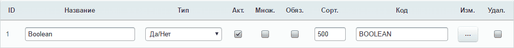

# Свойство "Да/Нет" для модуля "Информационные блоки"

* PHP >= 5.5.0

## Установка
```bash
composer require SerginhoLD/bitrix-boolean-property
```
Для установки модуля в папку `/local/` добавить следующий код в `composer.json`:
```json
"extra": {
  "installer-paths": {
    "local/modules/{$name}/": ["type:bitrix-module"]
  }
}
```

